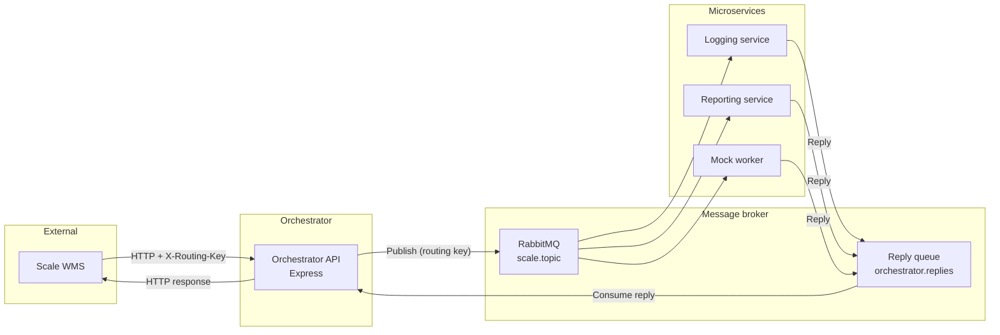
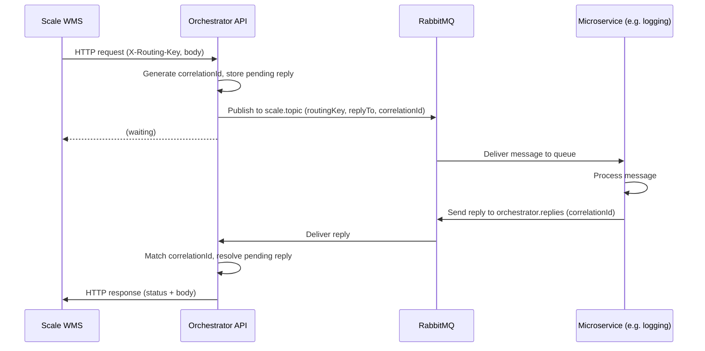
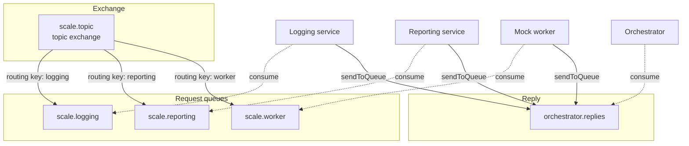

# Scale WMS – Architecture Design Document

**Version:** 1.0  
**Status:** POC  
**Last updated:** 2025

---

## 1. Purpose and scope

This document describes the architecture of the **Scale WMS Microservices Orchestrator**: a system that receives HTTP requests from the warehouse management system (Scale) and routes them to decoupled microservices via **RabbitMQ**. The WMS integrates through a single API (the orchestrator) and uses **HTTP headers** for routing, so no changes are required in Scale’s integration layer beyond setting the appropriate header.

**Scope:**

- Orchestrator API (single entry point)
- RabbitMQ as message broker
- Microservices: logging, reporting, mock worker (POC)
- Request–reply pattern so the WMS receives data back from microservices
- Deployment via Docker with restart policies

**Out of scope for this document:** Security (authn/authz), monitoring/observability, persistence inside microservices.

---

## 2. System context

| Actor / system      | Role |
|---------------------|------|
| **Scale WMS**       | External system; sends HTTP requests to the orchestrator with a routing key in headers and optional JSON body. Expects HTTP response (status + body) from the target microservice. |
| **Orchestrator API**| Single entry point; accepts requests, publishes to RabbitMQ, waits for reply, returns reply to WMS. |
| **RabbitMQ**        | Message broker; topic exchange for routing; dedicated reply queue for microservice responses. |
| **Microservices**   | Consumers of queues; process messages and send replies back to the orchestrator. |

---

## 3. Component overview

### 3.1 High-level architecture

### 3.2 Components

| Component           | Technology   | Responsibility |
|--------------------|-------------|----------------|
| **Orchestrator API** | Node.js, Express | Accept any HTTP method/path; read `X-Routing-Key` (or equivalent) from headers; publish request payload to RabbitMQ topic exchange with correlation ID and reply queue; consume from reply queue; match reply by correlation ID; return HTTP response to WMS. Timeout (default 30s) → 504. |
| **RabbitMQ**       | RabbitMQ 3.x | Topic exchange `scale.topic`; routing keys: `logging`, `reporting`, `worker`. Queue `orchestrator.replies` for microservice replies. Durable queues and exchange. |
| **Logging service** | Node.js, amqplib | Consume from queue bound to `logging`; process message; send reply `{ statusCode, body }` to `orchestrator.replies` with same correlation ID; ack. |
| **Reporting service** | Node.js, amqplib | Same pattern; queue bound to `reporting`. |
| **Mock worker**     | Node.js, amqplib | Same pattern; queue bound to `worker`. |

---

## 4. Data flow and request–reply

### 4.1 Request–reply sequence

### 4.2 Message payload (Orchestrator → Microservice)

The orchestrator publishes a JSON payload containing:

- `method` – HTTP method
- `path` – request path
- `query` – query string object
- `headers` – request headers
- `body` – request body (parsed or raw)
- `timestamp` – ISO timestamp

Message properties:

- `replyTo`: `orchestrator.replies`
- `correlationId`: UUID
- `contentType`: `application/json`

### 4.3 Reply payload (Microservice → Orchestrator)

JSON:

- `statusCode` (optional, default 200) – HTTP status to return to WMS
- `body` (optional) – response body (object or primitive)

The orchestrator returns this as the HTTP response to the WMS.

---

## 5. Messaging topology (RabbitMQ)

### 5.1 Topology diagram

### 5.2 Routing keys

| Routing key | Queue          | Consumer           |
|------------|----------------|--------------------|
| `logging`  | scale.logging  | Logging service    |
| `reporting`| scale.reporting| Reporting service  |
| `worker`   | scale.worker   | Mock worker        |

The WMS sets the desired routing key in the HTTP header `X-Routing-Key` (or `x-routing-key`, `x-scale-routing-key`).

---

## 6. Deployment

### 6.1 Docker topology

All components run as separate Docker containers:

- **rabbitmq** – single node; ports 5672 (AMQP), 15672 (Management UI); health check; `restart: unless-stopped`
- **orchestrator** – single instance; port 3000; depends on RabbitMQ healthy; `restart: unless-stopped`
- **logging-service**, **reporting-service**, **mock-worker-service** – one instance each by default; depend on RabbitMQ healthy; `restart: unless-stopped`

Scaling: multiple instances of a microservice can be run (e.g. `docker compose up -d --scale logging-service=3`). All instances consume from the same queue; RabbitMQ distributes messages (competing consumers).

### 6.2 Configuration

| Component     | Key env vars        |
|---------------|---------------------|
| RabbitMQ      | `RABBITMQ_DEFAULT_USER`, `RABBITMQ_DEFAULT_PASS` |
| Orchestrator  | `RABBITMQ_URL`, `ORCHESTRATOR_PORT`, `REPLY_TIMEOUT_MS` |
| Microservices | `RABBITMQ_URL`      |

---

## 7. Key design decisions

| Decision | Rationale |
|----------|------------|
| **Single orchestrator API** | WMS can call one base URL; routing is header-based so Scale only needs to set the right header. |
| **Routing key in HTTP header** | Headers are the only place easily configurable from the WMS for routing. |
| **Request–reply over RabbitMQ** | WMS needs synchronous responses; correlation ID + reply queue provides this without coupling WMS to individual service URLs. |
| **Topic exchange** | Allows multiple routing keys and future pattern-based bindings (e.g. `logging.#`) if needed. |
| **Durable queues and exchange** | Messages survive broker restart. |
| **Docker restart: unless-stopped** | Services recover automatically after crashes or host restart. |

---

## 8. References

- **README.md** – Setup, routing keys, quick test, WMS integration, performance considerations.
- **README.ro.md** – Romanian translation of the README.
- **docker-compose.yml** – Service definitions and environment.
