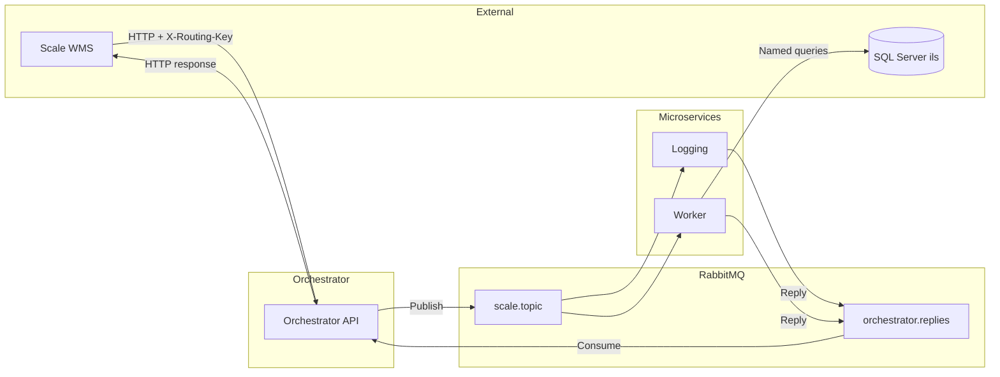
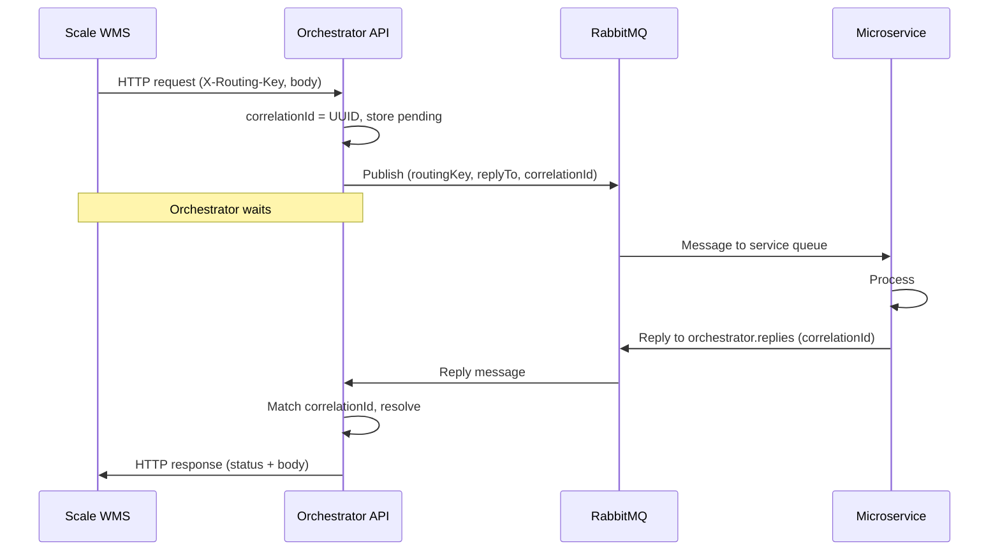
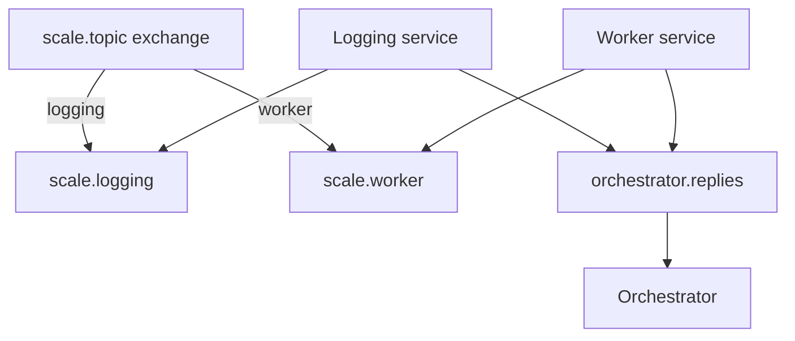
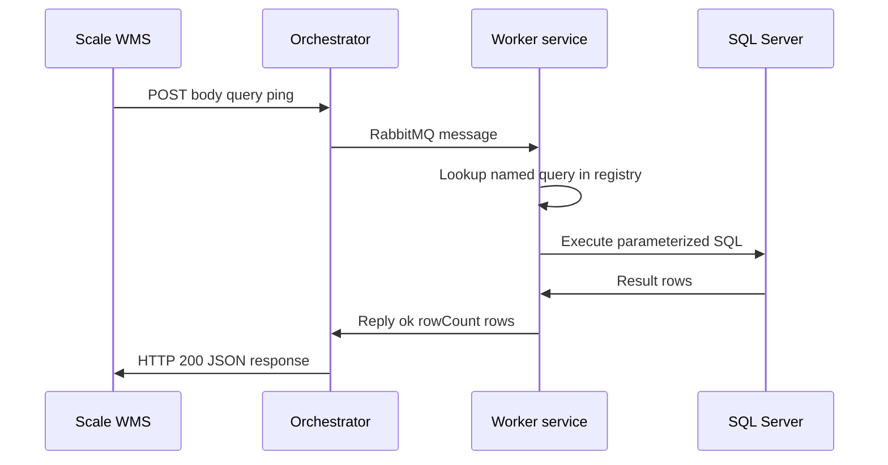
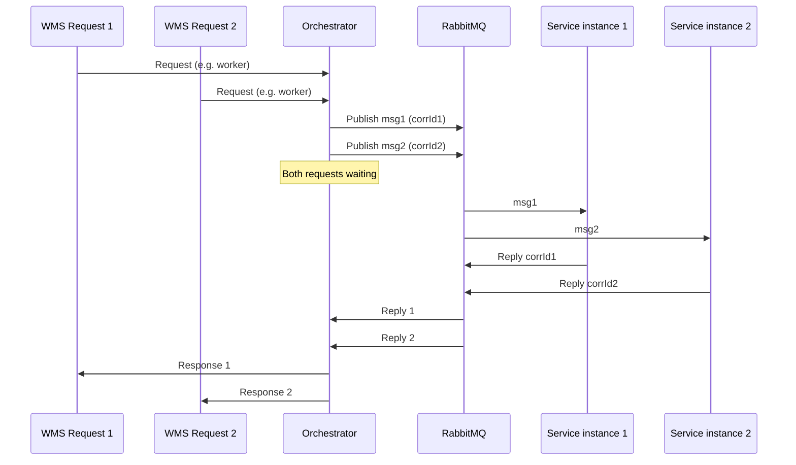

# Scale WMS – Flow diagrams

This file contains Mermaid diagrams that render in GitHub, GitLab, VS Code (with Mermaid extension), and many other tools. You can also export them to PNG/SVG using [Mermaid Live Editor](https://mermaid.live) or CLI.

---

## 1. Architecture (components and connections)

---

## 2. Request–reply sequence (single request)

---

## 3. RabbitMQ topology (queues and bindings)

---

## 4. Worker SQL query flow

---

## 5. Concurrent requests (multiple WMS requests)

Replies can arrive in any order; the orchestrator matches each reply to the correct request via `correlationId`.
